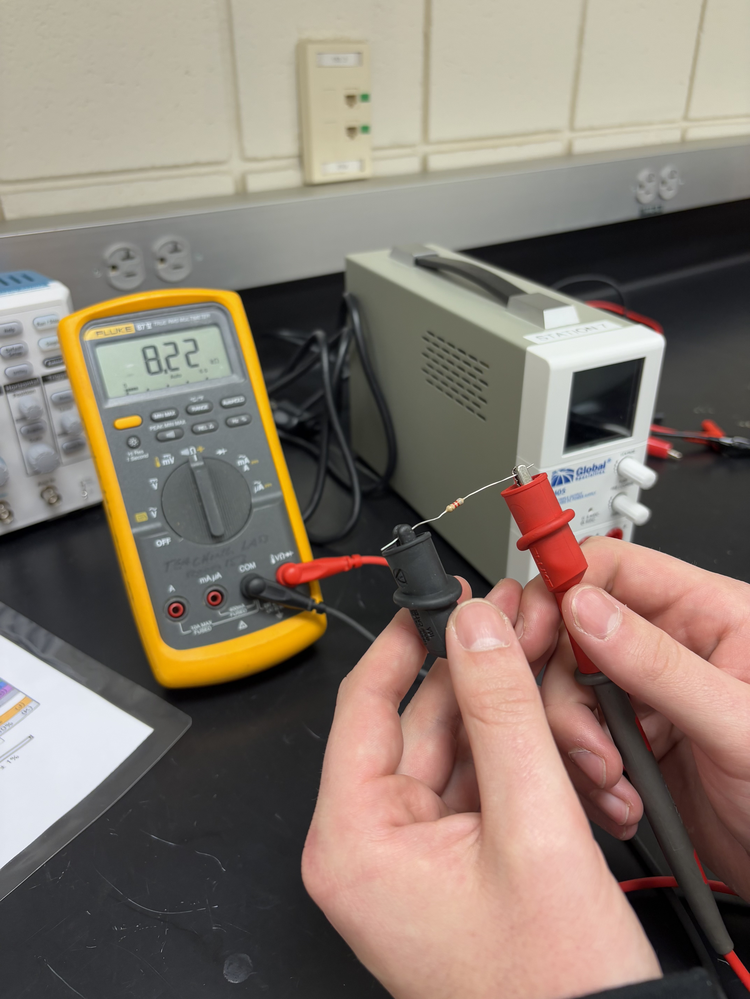

# Lab 1: Knowing Your Instruments

## Authors: Ashlyn Lippert and Seth Daniel

## Date: February 3rd, 2025

## Introduction:
   This lab introduces basic electronic test equipment, including a Digital Multimeter (DMM), an oscilloscope (O-scope), a Function Generator (F.G.), and a Direct Current Power Supply (DCPS). The goal was to understand how each tool works, practice obtaining accurate measurements, and obtain hands-on practice. During the lab, different electronic signals were created and measured using the equipment.
   Additionally, this lab provided instruction on how to use GitHub to write lab reports and the basics for navigating and understanding the GitHub interface.

## Materials:
1. Four different resistors (any value)
2. Four different capacitors (any value, one must be catalytic)
3. 10KΩ Resistor

## Assembly Methods:

**Objective 1: Use the above-listed lab equipment to measure and verify equipment, component, and
circuit values**

1. **Resistor Measurement Setup:**
   
   Identified four different resistors and recorded their color codes to determine expected values, then we used a Fluke 87 V DMM to measure the actual resistance by connecting the alligator clips to each resistor's leads.
   We then compared the measured values with expected values and checked if they were within tolerance. We also measured the resistance of the DMM cables and subtracted it from the resistor measurements to improve our measurement accuracy.

3. **Capacitor Measurement Setup:**
   
   We started by identifing four different capacitors and recorded their expected capacitance values using the Fluke 87 V DMM in capacitance mode to measure each capacitor. For the electrolytic capacitor, we made sure to ensure proper orientation. After identifying and measuring the capacitance of each capacitor, we compared the measured values with expected values and noted any discrepancies.

5. **DC Power Supply Configuration:**
   
   To configure the power source, we first located the DC Power Supply (DCPS) and ensured it was plugged in and powered on. To familiarize ourselves with the equipment, we identified the settings, knobs, and display indicators, then adjusted the voltage output to +1.5V, +7.0V, and +12.0V.
   Using the DMM, we measured each voltage output and compared the readings with the DCPS display. Additionally, we measured the fixed 3.3V, 5.0V, and 12V outputs to verify their accuracy.

7. **Function Generator and Oscilloscope Setup:**
   
   We began by connecting a 10KΩ resistor to the output of the Function Generator (FG), then set the FG to produce a 2kHz sine wave at maximum amplitude. Using the oscilloscope, we observed the waveform and measured amplitude and frequency using four different methods:
     1. Counting squares on the oscilloscope screen.
     2. Using the moveable cursors on the oscilloscope.
     3. Using the measurement features of the oscilloscope.
     4. Measuring with the Fluke DMM.
   
   Additionally, we adjusted frequency and amplitude of the generated wave and observed changes on both the oscilloscope and DMM and recorded our findings.

**Objective 2: Learn how to use GitHub for collaboration and to post your report**

1. Create a GitHub account and verify email address.
2. Add lab partners as collaborators for your lab report repository.
   

## Test Equipment:
1. Fluke 87 V DMM
2. Oscilloscope Tektronix TS2012
3. Function Generator
4. DC Power Supply
5. Computer with internet access
   
## Test Procedures:

**Objective 1: Use the above-listed lab equipment to measure and verify equipment, component, and
circuit values**

1. **Resistor Measurement**

   For this part of the experiment, we measured the resistance of four different resistors using a Digital Multimeter (DMM) and compared the results to the expected values based on the resistor color codes. We recorded the expected resistance, the acceptable tolerance range, and the measured resistance in a table. To ensure accuracy, we also measured the resistance of the test leads and subtracted this value from our readings. Any resistors that fell outside the expected range were noted.

  
  
<b>Figure 1:</b> Measurement of resistor value using DMM.

3. **Capacitor Measurement**

   We used the DMM to measure the capacitance of four capacitors and compared the results to their expected values. For the electrolytic capacitor, we also tested whether polarity affected the readings. The measured values were recorded, and any deviations from the expected capacitance were analyzed.

  
  
<b>Figure 1:</b> Measurement of ceramic capacitor value using DMM.

  
  
<b>Figure 2:</b> Measurement of electrolytic resistor value using DMM.

4. **Power Supply Check**

   To verify the accuracy of the power supply, we set it to different voltage levels (1.5V, 7.0V, and 12.0V) and measured the output using the DMM. We then compared the DMM readings with the voltage displayed on the power supply. Additionally, we measured the auxiliary outputs (3.3V and 5.0V) to ensure they were within the expected range.

  
  
<b>Figure 3:</b> Measurement of DCPS voltage auxillary outputs.

5. **Function Generator Output**

   We set the function generator to produce a 2kHz sine wave at maximum amplitude and measured the output using multiple methods. These included:
      - Counting squares on the oscilloscope screen
      - Using the oscilloscope’s moveable cursors
      - Utilizing the oscilloscope’s built-in measurement functions
      - Measuring the signal with the DMM
  

  
  
<b>Figure 4:</b> Setup for 2 kHz sine wave generation on function generator.

  
  
<b>Figure 5:</b> Sine wave output generated on oscilloscope from generated function.

**Objective 2: Learn how to use GitHub for collaboration and to post your report**

1. Open the tutorial at [GitHub Hello World](https://docs.github.com/en/get-started/quickstart/hello-world)
2. Create a new repository on GitHub by clicking the "+" icon, naming it "hello-world", and adding a README file. This repository will serve as the folder that holds all your project files.
3. Make a new branch called "readme-edits" from the main branch so you can work on changes without affecting the main version. This branch is a copy of the main branch at the time you create it.
4. Edit the README.md file in the "readme-edits" branch and add some information about yourself, then commit the changes with a brief message. Each commit saves your changes along with a message explaining what you did.
5. Open a pull request to propose merging your changes from "readme-edits" into the main branch. This lets you review your changes and start a discussion about them.
6. Merge the pull request to combine your changes into the main branch and then delete the "readme-edits" branch if you no longer need it. Merging finalizes the changes so they become part of your main project. The tutorial is now complete.
7. Create a new public repository named "BAE305-SP25-Lab1" and initialize it with a README.
8. Navigate to the Wiki tab and create the lab report on the wiki page.
9. Reference the [Lab Report Example](https://github.com/cjarro-uky/BAE305-Lab-Template/wiki/Lab-Report-Example) to understand the formatting and expectations for the lab report.
10. Upload our images to the repository, copy their links, and insert them into the file. Center and resize the images as necessary and make sure to add captions.
12. Complete all necessary sections of the lab report and discussion questions, then ubmit the link to the lab report page on GitHub via Canvas.

## Test Results:
| Resistance of DMM Cables (Ohms) |
|---------------------------------|
|          1.2                    |

**Resistor Values:**

| Resistor # | Band 1 | Band 2 | Band 3 | Band 4 | Expected Resistance (Ohms) | Tolerance | Max Value (Ohms) | Min Value (Ohms) | Measured Resistance (Ohms) | Measured Resistance - Resistance of Cables (Ohms) |
|------------|--------|--------|--------|--------|--------------------------|-----------|----------------|----------------|----------------------|---------------------------------|
| 1          | Yellow | Purple | Green  | Gold   | 4700000                  | 5%        | 4935000        | 4465000        | 4720000              | 4719998.8                         |
| 2          | Brown  | Green  | Black  | Gold   | 15                        | 5%        | 15.75          | 14.25          | 15.7                  | 14.5                               |
| 3          | Brown  | Gray   | Brown  | Gold   | 180                       | 5%        | 189            | 171            | 187                   | 185.8                              |
| 4          | Gray   | Red    | Red    | Gold   | 8200                      | 5%        | 8610           | 7790           | 8230                  | 8228.8                             |

**Capacitor Values:**
| Capacitor # | Capacitor Type | Expected Capacitance (F) | Tolerance | Max Expected Capacitance (F) | Min Expected Capacitance (F) | Measured Capacitance (F) |
|-------------|----------------|--------------------------|-----------|------------------------------|-------------------------------|---------------------------|
| 1           | Electrolytic   | 0.00047                  | 20%       | 0.000564                        | 0.000376                     | 0.00053                  |
| 2           | Ceramic        | 0.000001                 | 5%        | 0.00000105                      | 0.00000095                    | 0.00000114               |
| 3           | Ceramic        | 2.2E-11                  | 5%        | 2.31E-11                        | 2.09E-11                      | 3E-10                    |
| 4           | Ceramic        | 0.000000001              | 10%       | 1.1E-09                         | 9E-10                         | 1.34E-09                 |

**Polarity Check for Electrolytic Capacitor:**
| DMM Lead #1 | DMM Lead #2 | Voltage Measurement (V) |
|-------------|-------------|-------------------------|
| Black       | Red         | 528                     |
| Red         | Black       | 528                     |

**Power Supply Voltage Verification:**
| Expected Current from DCPS (A) | Expected Voltage from DCPS (V) | DMM Voltage Measurement (V) |
|--------------------------------|--------------------------------|-----------------------------|
| 0                              | 1.5                            | 1.499                       |
| 0                              | 7                              | 7                           |
| 0                              | 12                             | 12                          |
| 0                              | 3.3/3.5                        | 3.417                       |

**Function Generator Output:**
|       Method        |  Wave Type  | Frequency (kHz) | Amplitude (V) |
|---------------------|-------------|-----------------|---------------|
| Counting Squares    | Sinusoidal  | 2.5             | 20            |
| Cursors             | Sinusoidal  | 2.267           | 20            |
| Measurement Feature | Sinusoidal  | 2.202           | 20.20         |
| DMM                 | Sinusoidal  | 2.2             | 7.16          |

## Discussion:

Discussion Question 1: Do the instruments measuring resistance agree with each other? Why?

The data from the voltage measurements shows that the readings from the Digital Multimeter (DMM) and the power supply are very close to each other. For example, when the power supply was set to 1.5V, the DMM measured 1.499V, and when set to 7.0V, the DMM also read exactly 7.0V. These small differences are expected due to slight variations in instrument calibration and measurement precision. Since the differences are minimal and within an acceptable range, we can conclude that the instruments agree with each other

Discussion Question 2: Do the instruments measuring peak voltage of the 2kHz sine wave agree with each other? Why?

The function generator was set to produce a 2kHz sine wave at maximum amplitude, and the signal was measured using different methods. While minor variations between readings were expected, the measurements were consistent overall. The oscilloscope readings depended on settings such as scale and resolution, while the DMM measured RMS voltage instead of peak values, which could explain discrepancies. Since all measurements remained within a reasonable range, we can conclude that the instruments agree with each other.

   The results demonstrate a good agreement between expected and measured values, with minor discrepancies which could be caused by measurement tolerances or equipment age and calibration. The capacitor measurements exhibited more variation, especially with smaller capacitance values, which is expected due to the DMM’s limitations in measuring low-capacitance components accurately.
Additionally, variations in the function generator’s output readings suggest that different measurement techniques introduce slight uncertainties.

   The results reinforce the importance of verifying measurements with multiple methods and instruments to identify any inconsistencies and improve measurement accuracy. Understanding instrument tolerances and proper calibration procedures is essential for reliable data collection.

## Conclusion:

